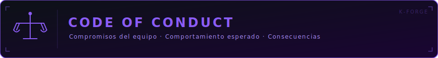

 

## ◈ Nuestro compromiso

En K-Forge nos comprometemos a crear un ambiente **inclusivo, respetuoso y libre de acoso** para todos, sin importar experiencia, genero, orientacion, discapacidad, apariencia, origen etnico o religion.

Nos comprometemos a actuar e interactuar de maneras que contribuyan a una comunidad abierta, acogedora, diversa, inclusiva y sana.

 

## ◈ Comportamiento esperado

- Trata a todos con **respeto y empatia**.
- Acepta la critica constructiva con apertura.
- Prioriza el bien del equipo sobre el individual.
- Se profesional en todas las interacciones.
- Colabora de buena fe, compartiendo conocimiento y ayudando a otros miembros a crecer.

 

## ◈ Comportamiento inaceptable

- Comentarios ofensivos, discriminatorios o de acoso.
- Publicar informacion privada de otros sin permiso.
- Conducta intimidante o amenazante.
- Cualquier forma de trolling o ataques personales.
- Presentar el trabajo de otros como propio (plagio).
- Compartir codigo, credenciales o recursos del proyecto con personas no autorizadas.

 

## ◈ Contexto academico

K-Forge es un club de desarrollo de software de la Fundacion Universitaria Konrad Lorenz. Este codigo de conducta se aplica dentro de un contexto academico y formativo. Esperamos que todos los miembros:

- Mantengan la integridad academica en todo momento.
- Contribuyan activamente al aprendizaje colectivo.
- Respeten las politicas institucionales de la Konrad Lorenz.
- Utilicen los recursos del club exclusivamente para los fines del proyecto.

 

## ◈ Alcance

Este codigo se aplica en todos los espacios del club:

- Repositorios de GitHub de la organizacion K-Forge.
- Canales de comunicacion (Discord, WhatsApp, correo electronico).
- Reuniones presenciales o virtuales del club.
- Cualquier representacion publica de K-Forge.

 

## ◈ Consecuencias

Las violaciones a este codigo seran evaluadas por el equipo fundador y pueden resultar en:

| Nivel | Accion |
|---|---|
| **1** | Advertencia privada |
| **2** | Suspension temporal del equipo |
| **3** | Expulsion permanente de K-Forge |

 

## ◈ Reporte

Si presencias o eres victima de una violacion, reporta de forma confidencial a:

**kforge.dev@gmail.com** — asunto: *Reporte de conducta*

 

---

  Basado en el <a href="https://www.contributor-covenant.org/es/version/2/1/code_of_conduct/">Contributor Covenant v2.1</a>

