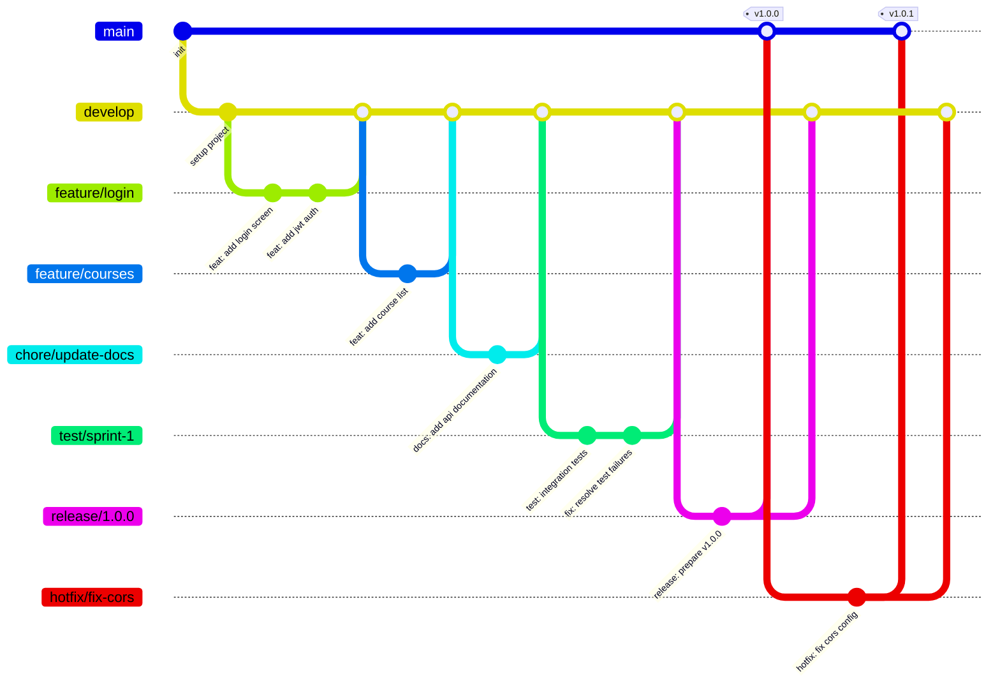

<br/>

## ◈ Antes de empezar

1. Se miembro activo de K-Forge o solicita acceso en [kforge.dev@gmail.com](mailto:kforge.dev@gmail.com).
2. Familiarizate con el proyecto al que deseas contribuir.
3. Lee este documento completo.

<br/>

## ◈ Convencion para Commits

Seguimos la convencion de **Conventional Commits**. Formato:

```
type: short message in english
```

> El mensaje siempre debe estar en **ingles**, en **minusculas**, y sin punto final. No usar scopes entre parentesis.

### Tipos de Commits

| Tipo       | Descripcion                                                  |
| ---------- | ------------------------------------------------------------ |
| `feat`     | Nueva funcionalidad                                          |
| `fix`      | Correccion de errores                                        |
| `chore`    | Tareas de mantenimiento del proyecto                         |
| `release`  | Preparacion de una nueva version                             |
| `hotfix`   | Correccion urgente en produccion                             |
| `docs`     | Cambios en documentacion                                     |
| `refactor` | Refactorizacion de codigo sin cambiar comportamiento         |
| `test`     | Agregar o modificar tests                                    |

### Ejemplos correctos

```
feat: add login screen
fix: resolve jwt token expiration bug
chore: update spring boot dependencies
docs: add branching guide to contributing
refactor: extract user validation logic
test: add integration tests for user service
release: prepare version 1.0.0
hotfix: fix cors config in gateway
```

### Ejemplos incorrectos

| Ejemplo | Problema |
|---|---|
| `update` | No describe nada util |
| `cambios` | Ambiguo y no esta en ingles |
| `FEAT: Add product` | No usar mayusculas |
| `feat(api): add product` | No usar scopes entre parentesis |
| `feat: Add Product.` | No usar mayusculas ni punto final |
| `fix: fixed the bug` | Vago — que bug, donde |

<br/>

## ◈ Estrategia de Ramas y Flujo (Git Flow)

Usamos **Git Flow**. Regla base: casi todo sale de `develop`; solo `hotfix/*` sale de `main`.

### Visual rapido del flujo



### Tipos de ramas y uso correcto

| Rama        | Para que se usa                                 | Crear desde | PR/Merge hacia      | Eliminar |
| ----------- | ----------------------------------------------- | ----------- | ------------------- | -------- |
| `main`      | Codigo estable en produccion                    | —           | —                   | Nunca    |
| `develop`   | Integracion de trabajo diario                   | `main`      | `main` (via release)| Nunca    |
| `feature/*` | Nueva funcionalidad                             | `develop`   | `develop`           | Tras merge a `develop` |
| `bugfix/*`  | Bug no urgente detectado en desarrollo          | `develop`   | `develop`           | Tras merge a `develop` |
| `chore/*`   | Mantenimiento (docs, CI/CD, deps, configs)     | `develop`   | `develop`           | Tras merge a `develop` |
| `test/*`    | Pruebas temporales o validaciones tecnicas      | `develop`   | `develop` (si aplica)| Tras merge o al descartar |
| `release/*` | Preparar version (ajustes finales, versionado)  | `develop`   | `main` y `develop`  | Tras merge a ambos |
| `hotfix/*`  | Incidente urgente en produccion                 | `main`      | `main` y `develop`  | Tras merge a ambos |

### Convencion de nombres

Formato: `<tipo>/<descripcion-en-kebab-case>`.

```
feature/student-dashboard
bugfix/fix-null-pointer-product
chore/update-spring-dependencies
hotfix/fix-cors-gateway
release/1.2.0

feature/changes      (incorrecto: muy vago)
mi-rama              (incorrecto: sin prefijo)
feature/StudentDash  (incorrecto: no kebab-case)
feat/login           (incorrecto: usar feature/*)
```

### Crear ramas — comandos de referencia

```bash
# Feature (nace de develop)
git checkout develop && git pull origin develop
git checkout -b feature/nombre-descriptivo

# Bugfix (nace de develop)
git checkout develop && git pull origin develop
git checkout -b bugfix/descripcion-del-bug

# Chore — docs, configs, dependencias (nace de develop)
git checkout develop && git pull origin develop
git checkout -b chore/descripcion-tarea

# Hotfix — urgente en produccion (nace de main)
git checkout main && git pull origin main
git checkout -b hotfix/descripcion-urgente

# Release (nace de develop)
git checkout develop && git pull origin develop
git checkout -b release/x.y.z
```

### Workflow minimo recomendado

```bash
# 1) Sincronizar develop
git checkout develop && git pull origin develop

# 2) Crear rama de trabajo
git checkout -b feature/nombre-del-trabajo

# 3) Commits atomicos y descriptivos
git add .
git commit -m "feat: add course enrollment endpoint"

# 4) Push y abrir PR hacia develop
git push origin feature/nombre-del-trabajo

# 5) Tras aprobacion y merge: eliminar rama
git branch -d feature/nombre-del-trabajo
git push origin --delete feature/nombre-del-trabajo
```

> Para `release/*` y `hotfix/*`: siempre abrir PR hacia `main` Y hacia `develop` para mantener ambas ramas sincronizadas.

<br/>

## ◈ Versionamiento

Seguimos **SemVer** (Semantic Versioning) con formato `MAJOR.MINOR.PATCH`.

| Segmento | Cuando incrementar                                | Ejemplo            |
| -------- | ------------------------------------------------- | ------------------ |
| `MAJOR`  | Cambios incompatibles con versiones anteriores    | `1.0.0` → `2.0.0`  |
| `MINOR`  | Nueva funcionalidad compatible hacia atras        | `1.0.0` → `1.1.0`  |
| `PATCH`  | Correcciones de errores en produccion (hotfix)    | `1.1.0` → `1.1.1`  |

### Versiones Pre-release

```
1.0.0-alpha.1    → Primera iteracion en desarrollo
1.0.0-beta.1     → Primera version en pruebas
1.0.0            → Version estable
```

Ciclo: **alpha** → **beta** → **release candidate** → **stable** → **maintenance / patch**

<br/>

## ◈ Pull Requests

- Titulo claro siguiendo convenciones de commits.
- Descripcion breve de **que** cambia y **por que**.
- Vincula el issue relacionado si existe.
- Asegurate de que el codigo compila y los tests pasan.
- Espera la revision de al menos **1 miembro** del equipo.

<br/>

## ◈ Estandares de codigo

Reglas generales aplicables a todos los proyectos del ecosistema:

| Elemento | Convencion |
|---|---|
| Clases, componentes | PascalCase |
| Metodos, funciones, variables | camelCase |
| Constantes | UPPER_SNAKE_CASE |
| Paquetes / modulos | minusculas |
| Indentacion JS/TS | 2 espacios |
| Indentacion Java/Kotlin | 4 espacios |
| Imports sin usar | Eliminar siempre |
| Credenciales en codigo | Nunca — usar `.env` |
| Codigo comentado sin uso | Eliminar antes del PR |

Cada proyecto define sus estandares especificos de framework en su `AGENTS.md`.

<br/>

## ◈ Reporte de bugs

Abre un **Issue** con:

- Descripcion del problema.
- Pasos para reproducirlo.
- Comportamiento esperado vs. actual.
- Capturas de pantalla si aplica.

<br/>

---

<div align="center">
  
  <br/>
  <a href="https://github.com/K-Forge">
    
  </a>
  &nbsp;
  <a href="https://kforge.vercel.app">
    
  </a>
  &nbsp;
  <a href="mailto:kforge.dev@gmail.com">
    
  </a>
  <br/><br/>
  <sub>Dudas? Contacta a tu lider de equipo o escribenos a <a href="mailto:kforge.dev@gmail.com"><strong>kforge.dev@gmail.com</strong></a></sub>
  <br/><br/>
  <a href="#top">
    
  </a>
</div>
