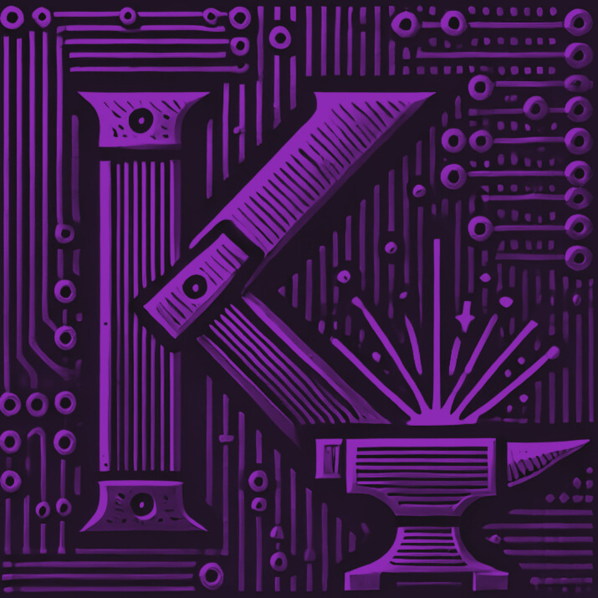
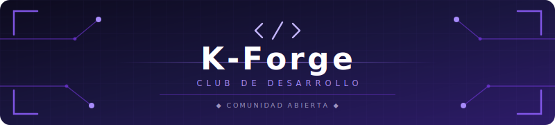

<table width="100%" style="border: none; background-color: transparent;">
  <tr style="border: none; background-color: transparent;">
    <td align="center" width="20%" style="border: none; padding: 0;">
      
    </td>
    <td align="center" width="80%" style="border: none; padding: 0;">
      
    </td>
  </tr>
</table>

 

  
  &nbsp;
  
    
  

 

> **Club de desarrollo de software** de la Fundacion Universitaria Konrad Lorenz.
> Construimos aplicaciones reales, aprendemos en equipo y generamos impacto.

 

## ◈ Manifiesto

K-Forge es el espacio donde estudiantes de la Konrad Lorenz **forjan** software real, no ejercicios de tutorial. Apostamos por:

- **Productos que se usan**, no proyectos que se archivan.
- **Arquitectura solida** sobre frameworks de moda.
- **Conceptos primero**, codigo despues.
- **Equipo** sobre individuo.

 

## ◈ Proyectos Activos

<table>
  <tr>
    <td width="50%" valign="top">
      <h3 align="center">◈ K-Forge Web</h3>
      

        
        
        
      

      
Sitio web oficial del club. Standalone components, signals, i18n (es/en), desplegado en Vercel.

      

        
        &nbsp;
        
      

    </td>
    <td width="50%" valign="top">
      <h3 align="center">◈ KApp</h3>
      

        
        
        
      

      
App movil para la comunidad Konradista. Clientes nativos en Kotlin (Android) y Swift (iOS), backend de microservicios Java 21 + Spring Boot 3.2.

      

        
        &nbsp;
        
      

    </td>
  </tr>
  <tr>
    <td width="50%" valign="top">
      <h3 align="center">◈ TiendaQ</h3>
      

        
        
        
      

      
Sistema de e-commerce universitario. Backend Java 25 + Spring Boot 4.0, frontend Angular 21, PostgreSQL.

      

        
        &nbsp;
        
      

    </td>
    <td width="50%" valign="top">
      <h3 align="center">◈ Roastory</h3>
      

        
        
        
      

      
Sistema de gestion para libreria-cafeteria. Node.js + Express 5, MongoDB Atlas, JWT, facturas PDF.

      

        
        &nbsp;
        
      

    </td>
  </tr>
</table>

 

## ◈ Stack del Ecosistema

  
  
  
  
  
  
  
  

 

## ◈ Equipo

Conoce a quienes hacen posible K-Forge → [**CONTRIBUTORS.md**](./CONTRIBUTORS.md)

 

## ◈ Como unirte

Estudiante de la Konrad Lorenz interesado en construir software real? Escribenos a **[kforge.dev@gmail.com](mailto:kforge.dev@gmail.com)** con tu nombre, semestre, carrera y que area te interesa (frontend, backend, mobile, DevOps, diseno).

 

---

  
   
  
  &nbsp;
  
  &nbsp;
  
    
  Fundado por <a href="https://github.com/13rianVargas"><strong>Brian Steven Vargas Clavijo</strong></a> · Con el apoyo de estudiantes de la <strong>Fundacion Universitaria Konrad Lorenz</strong>
    
  

