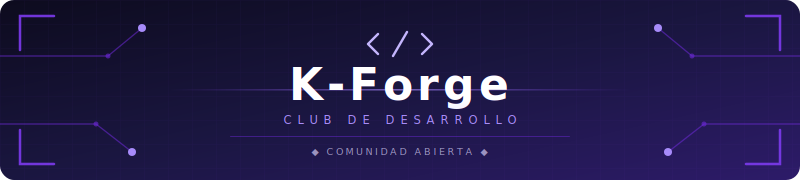

  

  
  
  

 

> **Club de desarrollo** de la Fundación Universitaria Konrad Lorenz.  
> Creamos aplicaciones reales, aprendemos en equipo y generamos impacto.

 

## ◈ Proyectos

<table>
  <tr>
    <td width="50%" valign="top">
      <h3 align="center">📲 KApp</h3>
      

        
      

      
App móvil para la comunidad Konradista. Acceso a eventos, horarios y herramientas universitarias.

    </td>
    <td width="50%" valign="top">
      <h3 align="center">🛒 TiendaQ</h3>
      

        
      

      
Plataforma web para explorar productos y realizar pedidos de la Tienda Q E-Commerce.

    </td>
  </tr>
  <tr>
    <td width="100%" valign="top" colspan="2">
      <h3 align="center">🔮 Próximamente</h3>
      

        
      

      
Nuevos proyectos en camino. ¿Tienes una idea? Proponla y lidera tu propio equipo.

    </td>
  </tr>
</table>

 

## ◈ Equipo

Conoce a quienes hacen posible K-Forge → [**CONTRIBUTORS.md**](./CONTRIBUTORS.md)

 

---

  Fundado por <a href="https://github.com/13rianVargas"><strong>Brian Steven Vargas Clavijo</strong></a> 
  Con el apoyo de estudiantes de la <strong>Konrad Lorenz</strong>

  

